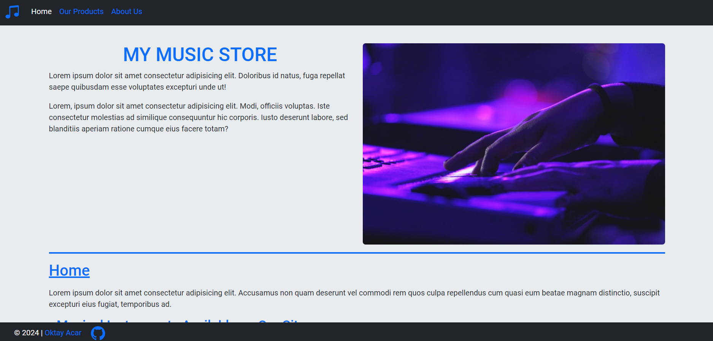
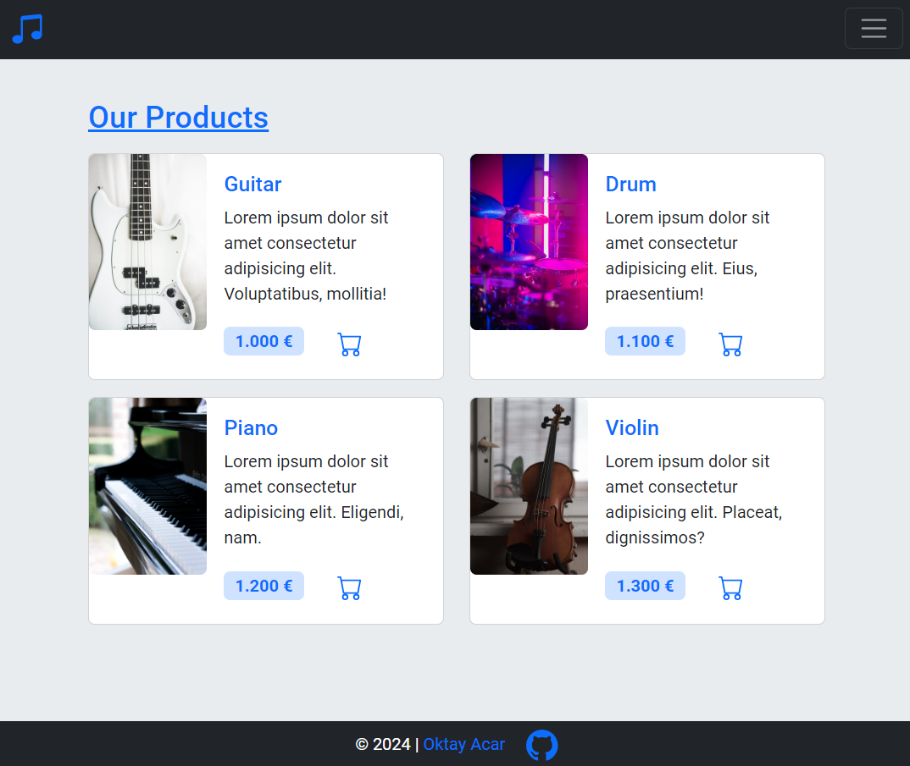

# My Music Store

## Description

This repository contains **My Music Store**, a beautifully designed, simple website that showcases a wide range of musical instruments and related content. This project features a responsive layout built with Bootstrap and custom CSS, ensuring an elegant user experience across all devices.

- **Bootstrap Version:** [5.3.3](https://getbootstrap.com/docs/5.3/getting-started/introduction/)

## Screenshot

The screenshots show only a portion of the web page.
| **'Home' Screenshot** |
| :--------------------------------------------------------------------------------------: |
|  |

|                  **'Products' Screenshot**                  |
| :---------------------------------------------------------: |
|  |

## Sources

- **Icon**
  - [GitHub Icon](https://icons.getbootstrap.com/icons/github/)
- **Images**
  - [Home Page](https://unsplash.com/photos/persons-hand-on-laptop-wKAOlN4A644)
  - [Guitar](https://unsplash.com/photos/white-and-black-electric-bass-guitar-on-white-surface-laHwVPkMTzY)
  - [Drum](https://unsplash.com/photos/man-playing-drum-on-stage-rHjqxNZU5OY)
  - [Piano](https://unsplash.com/photos/black-and-white-piano-in-close-up-photography-kGLYLMVs83g)
  - [Violin](https://unsplash.com/photos/a-violin-sitting-on-top-of-a-chair-next-to-a-window-2BjZ8q8paWw)

---

## License

This repository is licensed under the [MIT License](https://github.com/oktay-acar/my-music-store/blob/main/LICENSE).

## Author

[Oktay Acar](https://github.com/oktay-acar)
